class: center, middle

# Disclaimer

--

##Not an expert...

---
class: center, middle
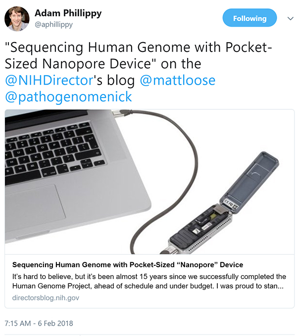
???
And Sergey Koren at the National Human Genome Research Institute (NHGRI)
---
layout: false
.left-column[
  ### **Overview of Next Generation Sequencing**
]

---
layout: false
.left-column[
  ### **Overview of Next Generation Sequencing**
  
  
  ### Illumina:
  #### 
]

--

.right-column[
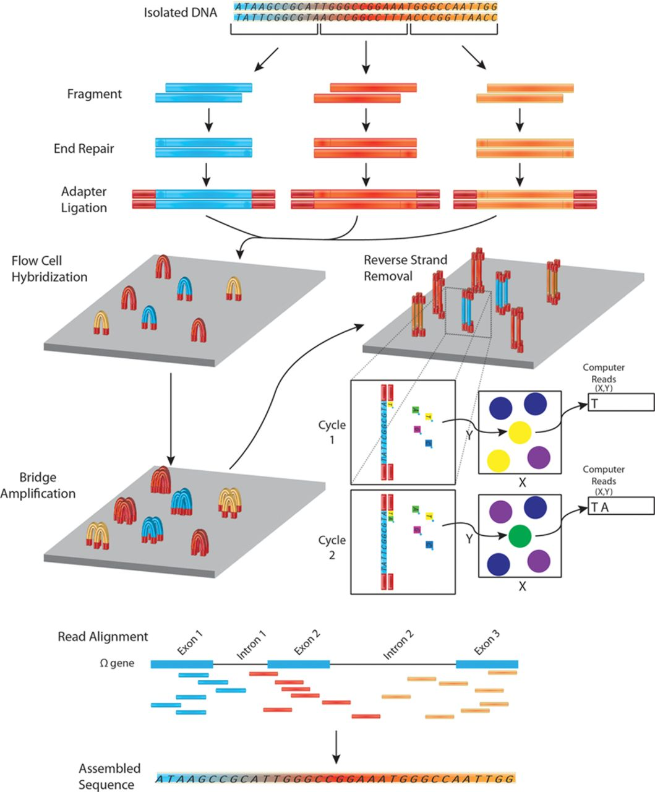
- Churko *et al.* 2013
]

---
layout: false
.left-column[
  ### **Overview of Next Generation Sequencing**
  
  
  ### Illumina:
  
  ### Issues with short reads:
]

--

.right-column[
<br><br><br>
### - **Repeat regions** or areas with low complexity may be lost
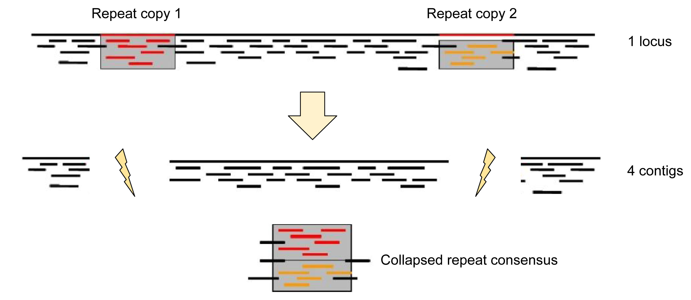
]
.footnote[Image from Torsten Seemann]


---
layout: false
.left-column[
  ### **Overview of Next Generation Sequencing**
  
  
  ### Illumina:
  
  ### Issues with short reads:
]

.right-column[
<br><br><br>
### - Short reads make **genome assembly** difficult 
]

.right-column[
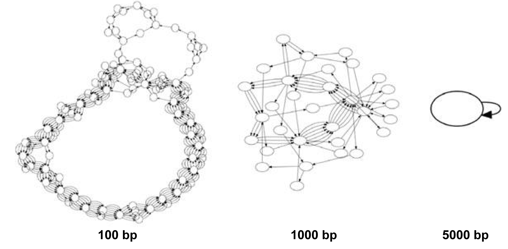
.footnote[Image from Torsten Seemann]
]

---

layout: false
.left-column[
  ### **Genome size**
]

---
layout: false
.left-column[
  ### **Genome size**
  
  
  ### Huge range:
]
.right-column[
<br><br><br>
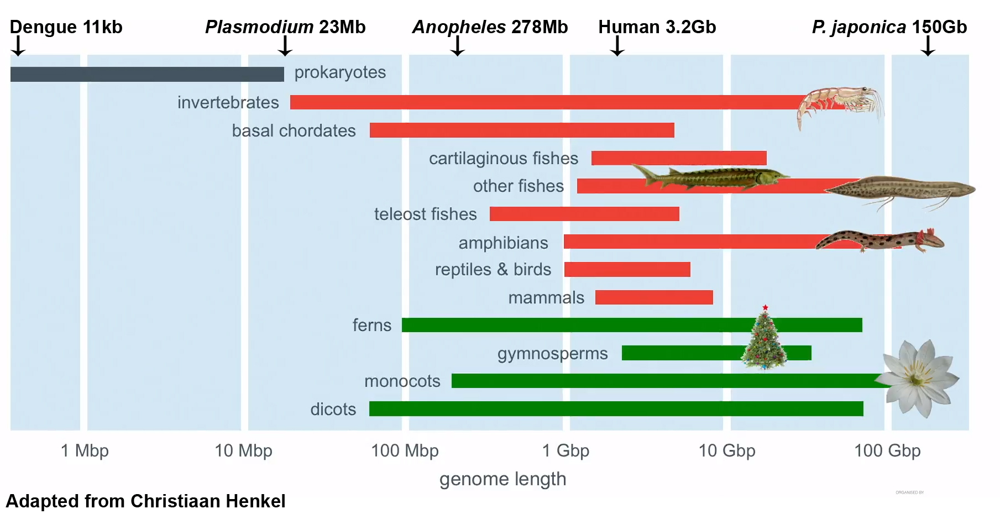 
]

???
1 kb = 1000 bases - thousand


1 Mb = 1,000,000 bases - million


1 Gb = 1,000,000,000 bases - billion

---
layout: false
.left-column[
  ### **Genome size**
  
  
  ### Huge range:
]

.right-column[
<br><br><br>
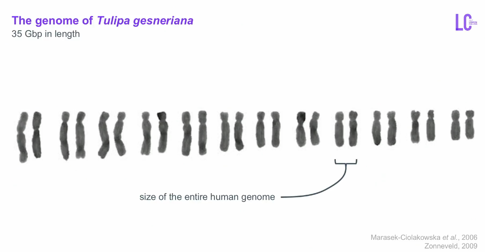 
]
.footnote[Image from Christiaan Henkel - https://www.youtube.com/watch?v=zRHCaaEfVvo]

???
But why do we care? Aren't these weird artifacts?

---
layout: false
.left-column[
  ### **Even "good" genomes have troubles:**
]

--

.right-column[
### **First human genome** - 2003
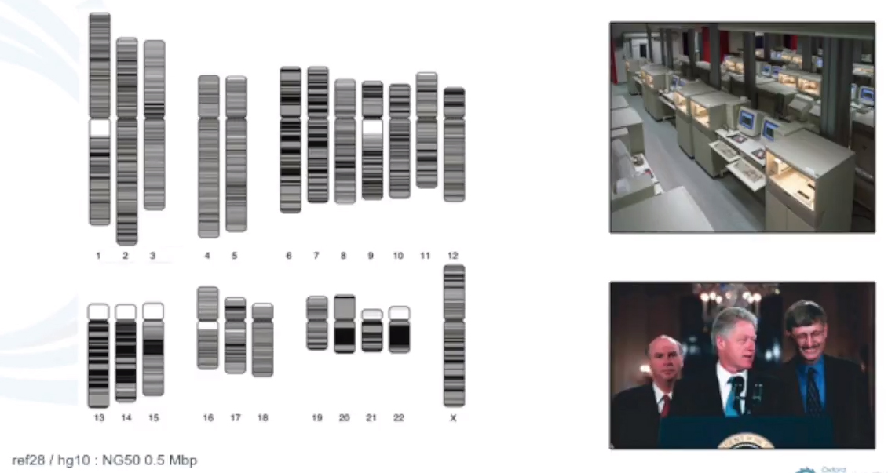
.footnote[Image from Sergey Koren]
]

???
NG50 is the median contig length

---
layout: false
.left-column[
  ### **Even "good" genomes have troubles:**
]

.right-column[
### Current **best** human genome 
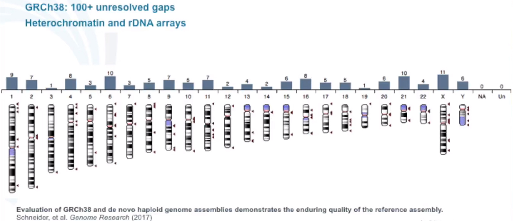
.footnote[Image from Sergey Koren]
]

???
Primary reason behind this is repeats and other non-complex regions, so then---what about longer reads?

---
layout: false
.left-column[
  ### **What about longer reads?**
]

--

.right-column[
### - Pacbio has introduced longer reads up to 60 kb.
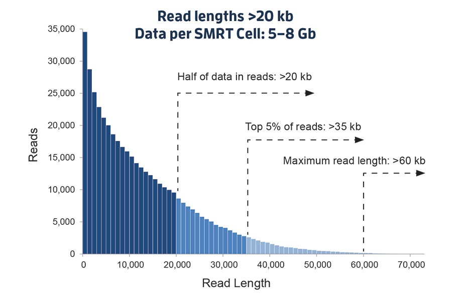
.footnote[https://www.pacb.com/smrt-science/smrt-sequencing/read-lengths/]
]

---
layout: false
.left-column[
  ### **What about longer reads?**
]

.right-column[
### - Though it is expensive, and error prone until high coverage.
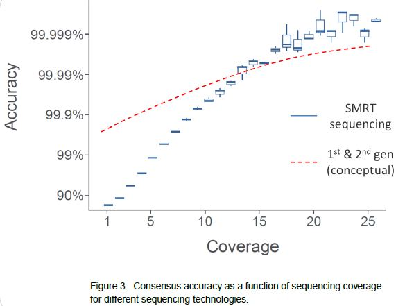
]
.footnote[https://www.pacb.com/uncategorized/a-closer-look-at-accuracy-in-pacbio/]

---

class: center, middle
#Nanopore Overview:

<iframe width="560" height="315" src="http://www.youtube.com/embed/E9-Rm5AoZGw?rel=0?start=0&end=147" frameborder="0" allowfullscreen></iframe>

---
layout: false
.left-column[
  ### **Nanopore Machines:**
]
.right-column[
<br><br><br>
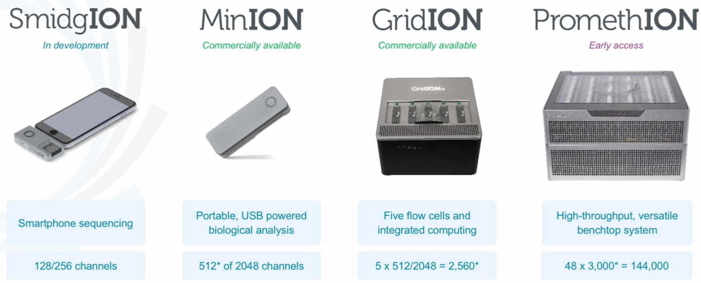
]
---
layout: false
.left-column[
  ### **Comparing technologies:**
]

.right-column[
<br><br><br><br>
```{r table, echo=FALSE} 
suppressWarnings(pacman::p_load(tidyverse, knitr, kableExtra))
df <- data.frame(Metric=c("Instrument", "Read Length", "Error Rate", "Output", "Instrument Price", "Run Price"),
                 Illumina=c("HiSeq 2500", "50-250 bp", "0.5-1%", "~25 Gb/Lane", "$740,000", "~$1300"),
                 PacBio=c("Sequel", "10-15 kb", "10-15%", "5 - 10 Gb", "$350,000", "~$850"),
                 Nanopore=c("MinION", "Up to 900 kb", "5-15%", "10-20 Gb", "$1000**", "$500-$900"))
df %>%
  kable('html', col.names = c("", "Illumina", "PacBio", "Nanopore"))
                 
```
]
---
layout:false
.left-column[
 ### **Unique Aspects:**
]
---

.left-column[
 ### **Unique Aspects:**
 
 
 ### Portable**:
]
.right-column[
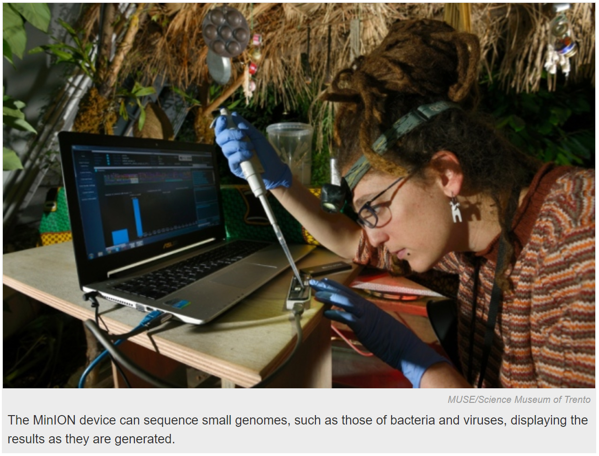
]
.foot-note[https://www.nature.com/news/pint-sized-dna-sequencer-impresses-first-users-1.17483]
---
layout: false
.left-column[
 ### **Unique Aspects:**
 
 
 ### Portable**:
 

 ### Nanopore reads can be **very** long:
]

.right-column[
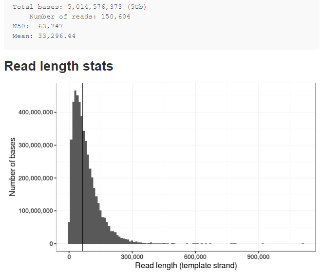
#### Longest aligned reads: 778217, 771227, 671129, 646399, 603564, 55941, 553029, 494330, 487836, and 470664 bases
]
.foot-note[http://lab.loman.net/2017/03/09/ultrareads-for-nanopore/]

???
Newest chemistry has bases going through the pore at 250 bases/second

---
.left-column[
  ### **What can you do with long reads?**
]

---

.left-column[
  ### **What can you do with long reads?**
  
  
  ### Span repeats.
]

.right-column[
<br><br><br>
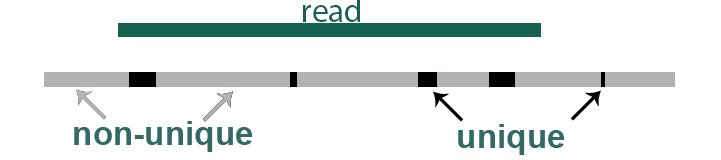
]

---
layout: FALSE
.left-column[
  ### **What can you do with long reads?**
  
  
  ### Span repeats.
  
  
  ### Lengthen contigs (clean up assemblies)
]

.right-column[
<br><br><br>

]
.footnote[### Image from Sergey Koren]

---
layout: FALSE
.left-column[
  ### **What can you do with long reads?**
  
  
  ### Span repeats.
  
  
  ### Lengthen contigs (clean up assemblies)
]

.right-column[
<br><br><br>
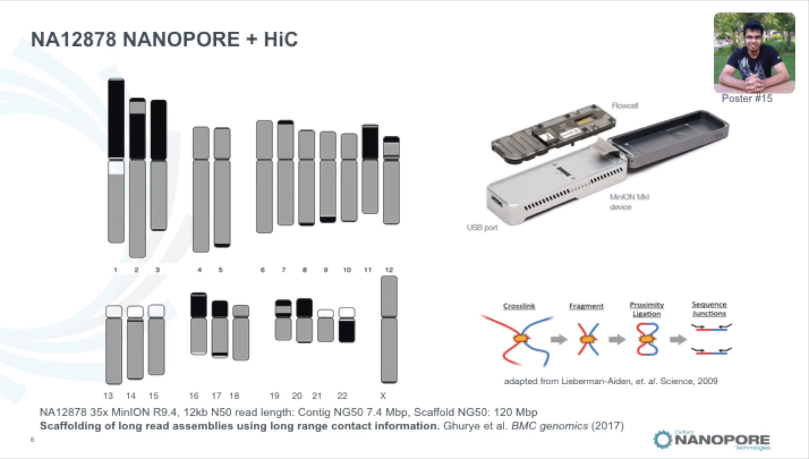
]
.footnote[### Image from Sergey Koren]

---
layout: FALSE
.left-column[
  ### **What can you do with long reads?**
  
  
  ### Span repeats.
  
  
  ### Lengthen contigs (clean up assemblies)
  
  
  ### Amplify **repeat regions** of interest
]

.right-column[
<br><br><br>
### Like **telomeres**
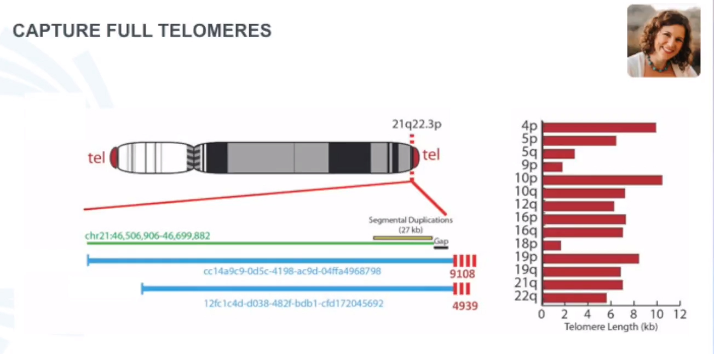
]
.footnote[### Image from Sergey Koren]

---
layout: FALSE
.left-column[
  ### **What can you do with long reads?**
  
  
  ### Span repeats.
  
  
  ### Lengthen contigs (clean up assemblies)
  
  
  ### Amplify repeat regions of interest
  
  
  ### Detect Splicing Variants
]

.right-column[
<br><br><br>
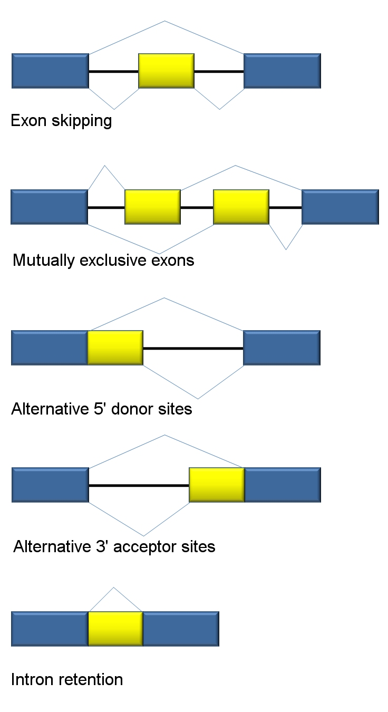
]
.footnote[CC BY-SA 3.0, https://commons.wikimedia.org/w/index.php?curid=6642977]

---

class: center, middle
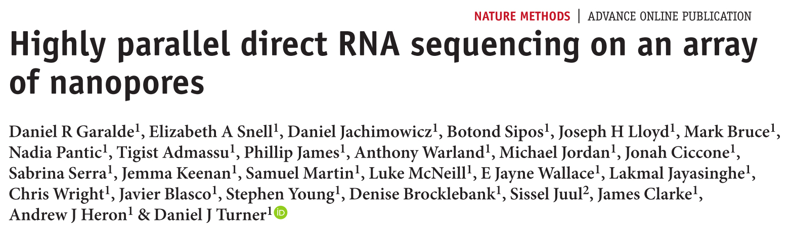

???
- About 6 months old


- 5Gb per RNA flowcell at max due to the different motor protein.
---
layout: false
.left-column[
  ## **Study Overview:**
]
.right-column[
- Study investigated direct (1D) and complemented (cDNA - 2D) RNA-sequencing of yeast mRNA (100-500 ng) on the MinION platform
compared to Illumina (100bp Paired-End).
]
--
.right-column[
- Used direct-RNA sequencing to analyze the External RNA Controls Consortium (ERCC) Panel (mixture of 92 poly-adenylated RNAs of known size/concentration).
]
--
.right-column[
- To detect splice isoforms, used the Spike in RNA Variants (SIRV) reference panel.
]
--
.right-column[
- Also determined ability to detect modified transcripts (methylated adenosine and cytosine) as they come through the pore.
]
---
.left-column[
## Why sequence direct from RNA? 
]
--
.right-column[
### - Can avoid confounders from PCR amplification related to GC content or duplication events.
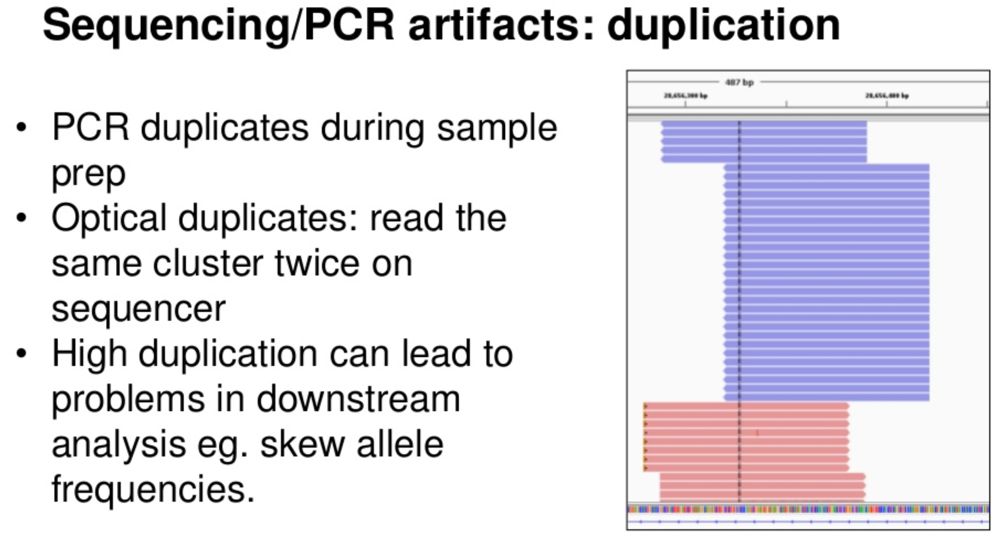
.foot-note[https://www.slideshare.net/AustralianBioinformatics/felicity-newell-ngs-mapping-errors-and-quality-control]
]


---
.left-column[
## Why sequence direct from RNA? 
]

.right-column[
### - Modifications on the transcripts are maintained ("epitranscriptomics").
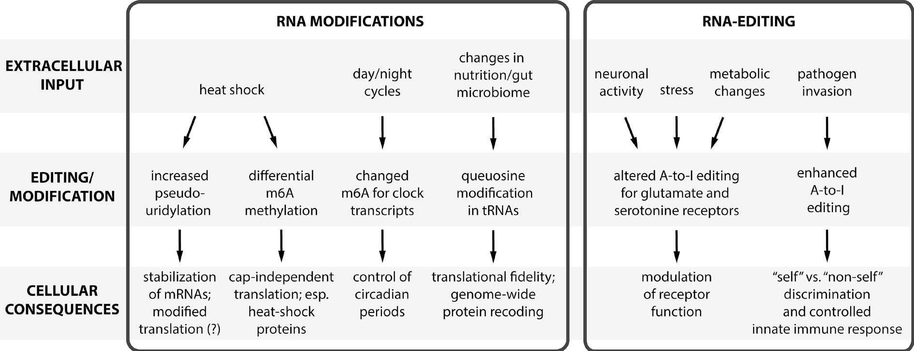
.foot-note[###*Licht and Jantsch, The Journal of Cell Biology, 2016*]
]

---
layout: false
.left-column[
  ## Figure 1b:
]
.right-column[
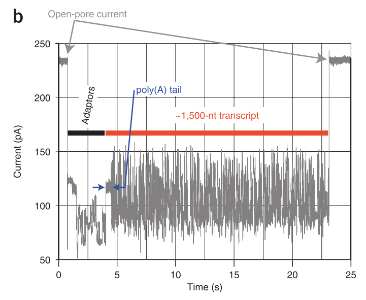
### Example 'squiggle' of transcript moving through pore.
]

---
layout: false
.left-column[
  ## Figure 1b:
  ## Supp. Fig. 1:
]
.right-column[
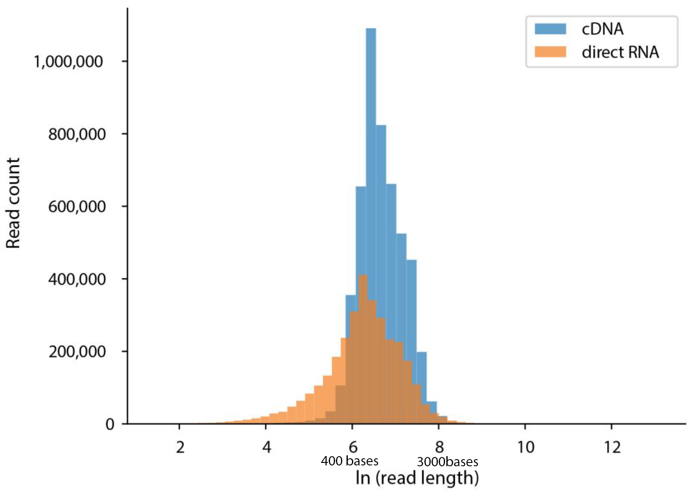
 ### Read lengths for direct RNA and cDNA.
]

---
layout: false
.left-column[
  ## Figure 1b:
  ## Supp. Fig. 1:
  ## Supp. Fig. 2a:
]
.right-column[
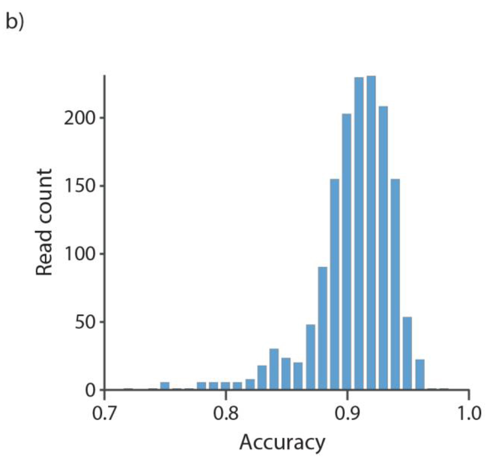
 ### Read accuracy for direct RNA.
]

---
layout: false
.left-column[
  ## Figure 1b:
  ## Supp. Fig. 1:
  ## Supp. Fig. 2a:
  ## Figure 2a:
]
.right-column[
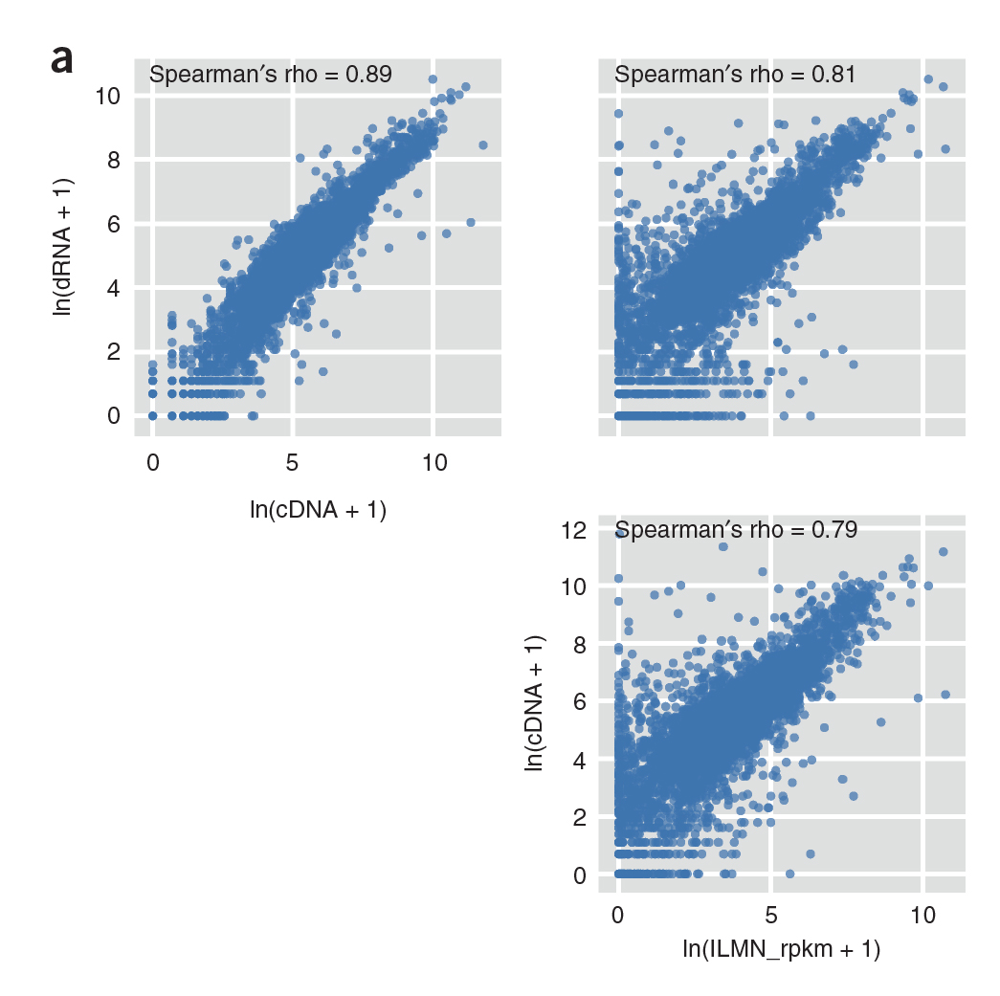
 ### Correlation of read counts after mapping.
]

---
layout: false
.left-column[
  ## Figure 1b:
  ## Supp. Fig. 1:
  ## Supp. Fig. 2a:
  ## Figure 2a:
  ## Figure 3a:
]
.right-column[

 ### ERCC reference library spike-in read counts.
]
---
layout: false
.left-column[
  ## Figure 1b:
  ## Supp. Fig. 1:
  ## Supp. Fig. 2a:
  ## Figure 2a:
  ## Figure 3a:
  ## Figure 4:
]
.right-column[
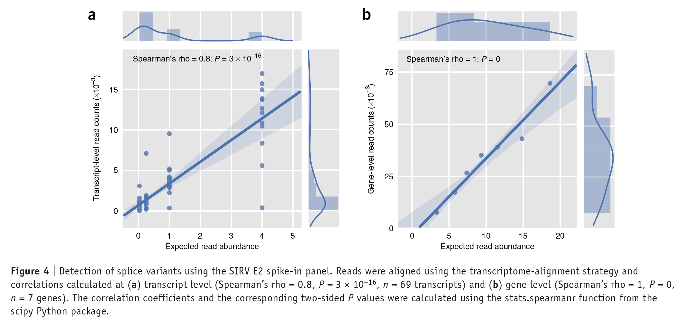
]
---
layout: false
.left-column[
  ## Figure 1b:
  ## Supp. Fig. 1:
  ## Supp. Fig. 2a:
  ## Figure 2a:
  ## Figure 3a:
  ## Figure 4:
  ## Figure 5:
]
.right-column[
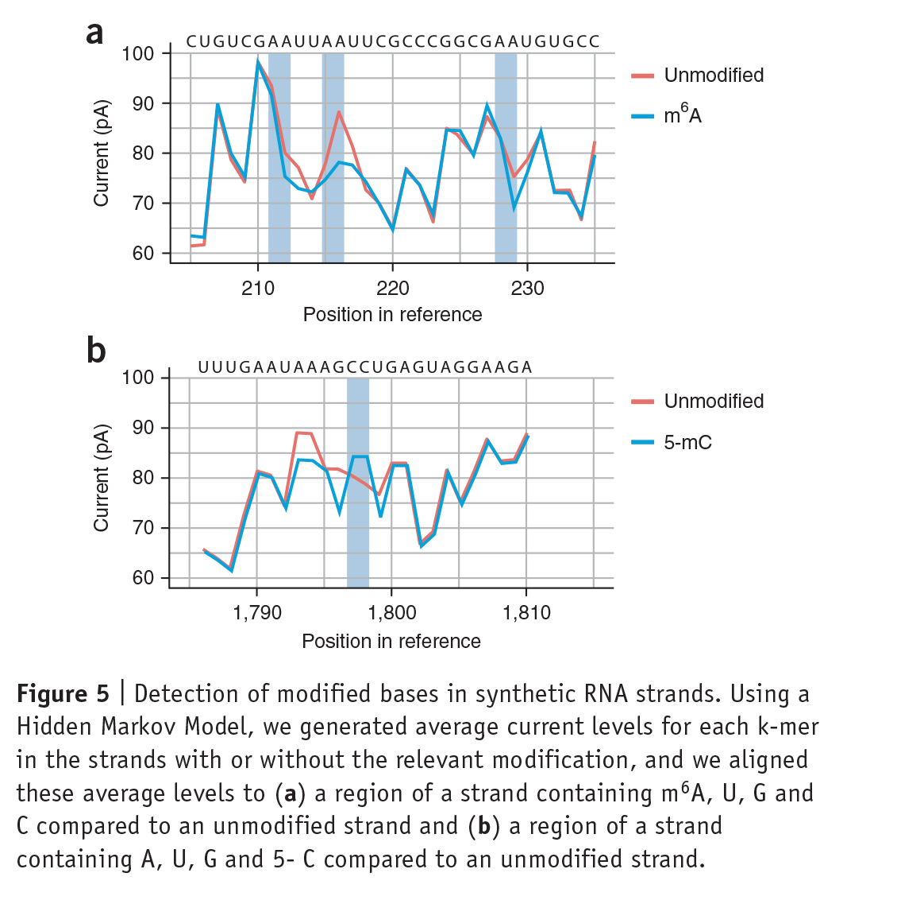
 ### Detection of modified bases.
]
---
layout: false
.left-column[
 ## **Criticisms:**
]
--
.right-column[
<br><br><br>
- **Error rate** is still high, though is reduced with higher coverage and 2D reads.
]
--
.right-column[
- Kits are still cold-chain limited, so **"portability"** is a bit tough to see.
]
--
.right-column[
- **500ng** minimum starting material for RNA is a bit high for some samples.
]
--
.right-column[
- Demonstration of **splice isoform** and **modified base** detection a bit weak.
]


